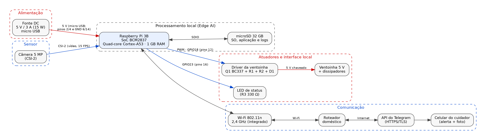
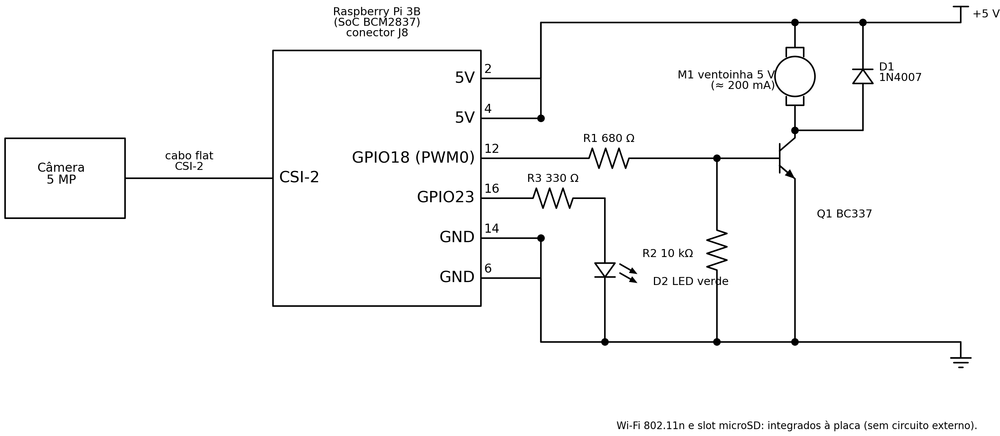

# Projeto Conceitual de _Hardware_

Este documento descreve o _hardware_ do **Projeto Alerta de Queda**, um protótipo de sistema embarcado não invasivo que detecta quedas por visão computacional na própria placa (_Edge AI_) e avisa o cuidador pelo Telegram. A descrição foi escrita para que outra pessoa consiga reproduzir o protótipo: cada subsistema vem acompanhado da justificativa da escolha.

## 1. Descrição dos subsistemas

### 1.1 Processamento

- **Raspberry Pi 3B** (SoC Broadcom BCM2837, quad-core ARM Cortex-A53, 1 GB de RAM) [1].
- **Justificativa:** a placa já está disponível para a equipe (TAP), tem Wi-Fi integrado, conector de câmera CSI-2 e pinos GPIO com PWM, o que dispensa módulos extras.
- **Restrição principal:** a inferência de pose roda continuamente na CPU, que opera próxima de 100% de carga. Sem dissipação adequada, o SoC chega a 80–85 °C e reduz o _clock_ (_thermal throttling_), o que derrubaria a taxa de quadros. Por isso o projeto inclui dissipadores e ventoinha controlada por temperatura (seção 1.3).

### 1.2 Sensor

| Característica | Valor |
|:--|:--|
| Sensor | Módulo de câmera de 5 MP, interface CSI-2 |
| Taxa de amostragem | 15 quadros por segundo (REQ-01) |
| Resolução de captura | 640 × 480 pixels (o modelo de pose recebe uma versão reduzida, por exemplo 256 × 256) |
| Campo de visão | Típico de ≈ 54° na horizontal para o módulo padrão de 5 MP (conferir no módulo utilizado) |
| Precisão necessária | Ombros e quadris devem ser distinguíveis pelo estimador de pose na distância máxima de uso; o valor final é validado nos testes de integração |

- **Por que CSI-2 e não USB:** os dados da câmera CSI-2 são tratados pelo GPU/ISP da placa e entregues à memória sem ocupar a CPU. Em câmeras USB, o protocolo e a decodificação do vídeo (por exemplo, MJPEG) consomem tempo de CPU, que é o recurso mais escasso do projeto [2].
- **Lente grande angular (opcional):** o campo de visão de ≈ 54° cobre uma área menor do cômodo. Uma lente grande angular (FOV > 120°) ampliaria a cobertura, mas não está no orçamento aprovado. Ela é tratada como melhoria opcional (item 2.1 do cronograma) e não entra nos totais da lista de materiais.

### 1.3 Atuadores

- **Ventoinha de 5 V** (≈ 200 mA): resfria o SoC e o controlador de rede. É acionada por **PWM no GPIO 18** (pino 12), e a rotação aumenta conforme a temperatura lida em `/sys/class/thermal/thermal_zone0/temp`. O GPIO não fornece essa corrente, então a ventoinha é chaveada por um transistor NPN (Q1, BC337), com diodo de roda livre (D1, 1N4007) em paralelo para absorver o pico indutivo.
- **LED de status** (verde): aceso indica que o serviço de monitoramento está ativo (REQ-08). Usa o GPIO 23 (pino 16) com resistor de 330 Ω.

### 1.4 Comunicações

- **Wi-Fi 802.11n (2,4 GHz)**, integrado à placa. Envia o alerta e a foto à API do Telegram por HTTPS, sem cabos de rede pelo cômodo (REQ-04). Exige conexão ativa com a internet por meio do roteador doméstico.
- **CSI-2:** ligação com a câmera por cabo flat.

### 1.5 Armazenamento

- **Cartão microSD de 32 GB, Classe 10:** guarda o sistema operacional, a aplicação e os _logs_.
- A imagem do alerta é gravada temporariamente em memória (_tmpfs_), e não no cartão, para reduzir escritas e o risco de corrupção do sistema de arquivos em caso de queda de tensão.

### 1.6 Interface com o usuário

- **Local:** apenas o LED de status. Não há botões nem _display_, o que mantém o sistema discreto e deixa mais memória livre para a inferência.
- **Remota:** o cuidador recebe o alerta e a foto no Telegram.

### 1.7 Alimentação

- **Fonte de 5 V / 3 A (15 W)** com conector micro USB.
- Picos de consumo durante a transmissão Wi-Fi, simultâneos à inferência, podem causar quedas transitórias de tensão e corromper o cartão SD. Por isso a escolha recai sobre uma **fonte estabilizada de boa qualidade, com folga de corrente** (3 A, contra ≈ 2,45 A de demanda de projeto, conforme a seção 4). A placa já possui capacitores de filtragem na entrada, e por isso não é necessário capacitor externo de desacoplamento.
- Os pinos 2 e 4 do conector J8 pertencem ao mesmo barramento de 5 V da entrada micro USB, portanto a corrente da ventoinha também passa pelo fusível de proteção da placa.

### 1.8 Estrutura física

- **Placa:** formato do Raspberry Pi 3B (85 × 56 mm), em _case_ com dissipadores de alumínio nos CIs principais e ventoinha.
- **Montagem na validação:** protótipo de bancada (o _case_ industrial final está fora do escopo). A câmera fica em suporte ajustável, elevado, simulando a instalação recomendada em um canto do teto (≈ 2,5 m de altura) com inclinação para o centro do cômodo.
- **Interface local:** o LED de status fica visível na parte externa do conjunto.

## 2. Diagrama de blocos

**Figura 1.** Diagrama de blocos do hardware. Setas vermelhas indicam energia e setas azuis indicam dados e sinais de controle.

## 3. Esquemático

**Figura 2.** Esquemático elétrico das interligações dos periféricos ao conector J8 da Raspberry Pi 3B (convenções de símbolos conforme [3]).

| Função | Conexão |
|:--|:--|
| Câmera | Cabo flat no conector CSI-2 da placa |
| Alimentação | Fonte 5 V / 3 A no micro USB; pinos 2 e 4 (5 V) e pinos 6 e 14 (GND) do J8 como barramentos do circuito da ventoinha e do LED |
| Ventoinha | M1 entre +5 V e o coletor de Q1 (BC337); emissor de Q1 no GND; base ligada ao pino 12 (GPIO 18, PWM) por R1 (680 Ω); R2 (10 kΩ) da base ao GND; D1 (1N4007) em paralelo com M1, com o cátodo no +5 V |
| LED de status | Pino 16 (GPIO 23) → R3 (330 Ω) → ânodo de D2 (LED verde); cátodo no GND |

**Dimensionamento dos componentes:**

- **R1 e Q1:** com o GPIO em 3,3 V e V_BE ≈ 0,7 V, a corrente de base é (3,3 − 0,7) / 680 ≈ 3,8 mA. Para uma corrente de coletor de 200 mA, o ganho necessário é ≈ 52, bem abaixo do ganho típico do BC337, o que garante a saturação (folha de dados do BC337 [4]). A corrente de base fica dentro do limite recomendado para um GPIO.
- **R2:** mantém a base em nível baixo enquanto o GPIO está indefinido (durante o _boot_), evitando que a ventoinha ligue sem comando.
- **D1:** protege Q1 contra o pico de tensão gerado quando a ventoinha é desligada.
- **R3:** com LED verde (V_F ≈ 2,0 V), a corrente é (3,3 − 2,0) / 330 ≈ 4 mA, suficiente para sinalização.

> As ligações iniciais podem ser testadas em _protoboard_, mas o esquemático acima é o documento de referência do circuito.

## 4. Lista de materiais (BOM) e consumo energético

A lista de materiais (_bill of materials_ [5]) traz preços, quantidades e a estimativa de consumo. A estimativa considera **1 hora de operação sob carga máxima** (inferência de pose e Wi-Fi ativos), com a equação E = V × I × t.

| Componente | Tensão (V) | Corrente (A) | Tempo (s) | Energia (J) | Quantidade | Preço | Observações |
|:--|:-:|:-:|:-:|:-:|:-:|:-:|:--|
| Raspberry Pi 3B | 5,0 | 1,200 | 3600 | 21.600,00 | 1 | R$ 420,00 | Corrente com CPU/GPU próximas de 100% |
| Câmera 5 MP (CSI-2) | 3,3 | 0,250 | 3600 | 2.970,00 | 1 | R$ 45,00 | Alimentada pelos reguladores da placa |
| Ventoinha 5 V | 5,0 | 0,200 | 3600 | 3.600,00 | 1 | R$ 51,00 | Preço do kit (case, dissipadores, ventoinha e cabo HDMI); consumo com a ventoinha a 100% |
| Cartão microSD 32 GB | 3,3 | 0,100 | 3600 | 1.188,00 | 1 | R$ 60,00 | Acesso contínuo de leitura/escrita |
| LED verde (D2) | 3,3 | 0,004 | 3600 | 47,52 | 1 | R$ 0,50 | Corrente limitada por R3 |
| Transistor BC337, diodo 1N4007 e resistores (330 Ω, 680 Ω, 10 kΩ) | – | – | – | – | 1 conjunto | R$ 2,00 | Consumo próprio desprezível (a base de Q1 usa ≈ 3,8 mA) |
| Fonte 5 V / 3 A | – | – | – | – | 1 | R$ 35,00 | É o suprimento do sistema, não uma carga |
| **Total estimado** | | | | **29.405,52** | | **R$ 613,50** | |

**Observações sobre a tabela:**

- A câmera e o cartão SD são alimentados pelos reguladores da própria Raspberry Pi, portanto parte da corrente deles já está incluída nos 1,2 A da placa. Somá-los torna a estimativa conservadora (superdimensionada), o que é desejável para o dimensionamento da fonte.
- O valor de R$ 613,50 é o **valor de mercado** de todos os itens. Os componentes avulsos que precisam ser adquiridos (LED, transistor, diodo e resistores) somam cerca de **R$ 2,50**, e os demais já estão disponíveis, de acordo com o orçamento do TAP (R$ 611,00 em itens já disponíveis).
- **Item opcional fora dos totais:** lente grande angular para a câmera (preço a definir).

### Dimensionamento da alimentação

1. Energia total em 1 hora: 29.405,52 J ÷ 3600 = **8,17 Wh**, o que corresponde a uma potência média de **8,17 W**.
2. Margem de segurança de **50%**, para cobrir os picos de chaveamento do Wi-Fi, a variação do consumo da CPU e a tolerância da fonte: 8,17 W × 1,5 = **12,25 W**.
3. Corrente correspondente em 5 V: 12,25 W ÷ 5 V ≈ **2,45 A**.
4. A fonte escolhida fornece 5 V × 3 A = **15 W**. Como 15 W > 12,25 W (e 3 A > 2,45 A), a fonte atende à demanda com folga. É essa folga que protege o sistema contra quedas transitórias de tensão.

Como o equipamento é alimentado pela rede elétrica, não há bateria no projeto; a escolha se resume à fonte.

## 5. Limitações do projeto de hardware

- O campo de visão da câmera padrão (≈ 54°) restringe a área monitorada a um cômodo pequeno ou a uma região dele; a lente grande angular é a melhoria prevista.
- Sem iluminação, a câmera comum não funciona (fora do escopo, conforme o TAP).
- A tensão de alimentação será monitorada nos testes com o comando `vcgencmd get_throttled`, que acusa subtensão e _throttling_. Se houver ocorrências, a solução prevista é trocar de fonte ou de cabo, e só em último caso acrescentar um capacitor de desacoplamento.
- A ventoinha e os dissipadores mantêm o SoC abaixo do limite de _throttling_; a temperatura em operação contínua será medida e registrada nos testes de subsistemas.

## Referências

1. Raspberry Pi Ltd., _Raspberry Pi hardware documentation_ (especificações da Raspberry Pi 3B, pinagem do GPIO e fonte de alimentação). Disponível em: [https://www.raspberrypi.com/documentation/computers/raspberry-pi.html](https://www.raspberrypi.com/documentation/computers/raspberry-pi.html).
2. Raspberry Pi Ltd., _Camera hardware_ (módulos de câmera e interface CSI-2). Disponível em: [https://www.raspberrypi.com/documentation/accessories/camera.html](https://www.raspberrypi.com/documentation/accessories/camera.html).
3. S. Gibilisco, _Beginner's guide to reading schematics_. McGraw-Hill Education, 2014.
4. ON Semiconductor, _BC337 / BC338 – Amplifier Transistors (NPN)_, folha de dados.
5. Wikipedia Contributors, _Bill of materials_. Disponível em: [https://en.wikipedia.org/wiki/Bill_of_materials](https://en.wikipedia.org/wiki/Bill_of_materials).
