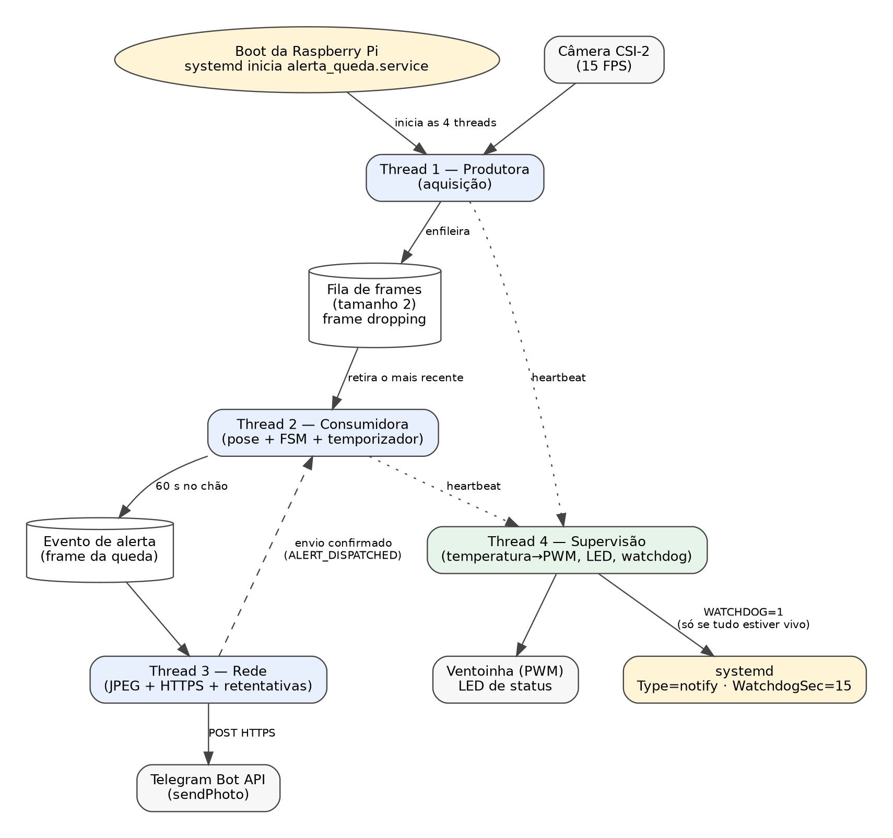
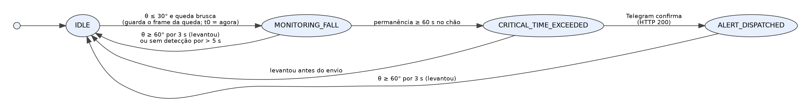
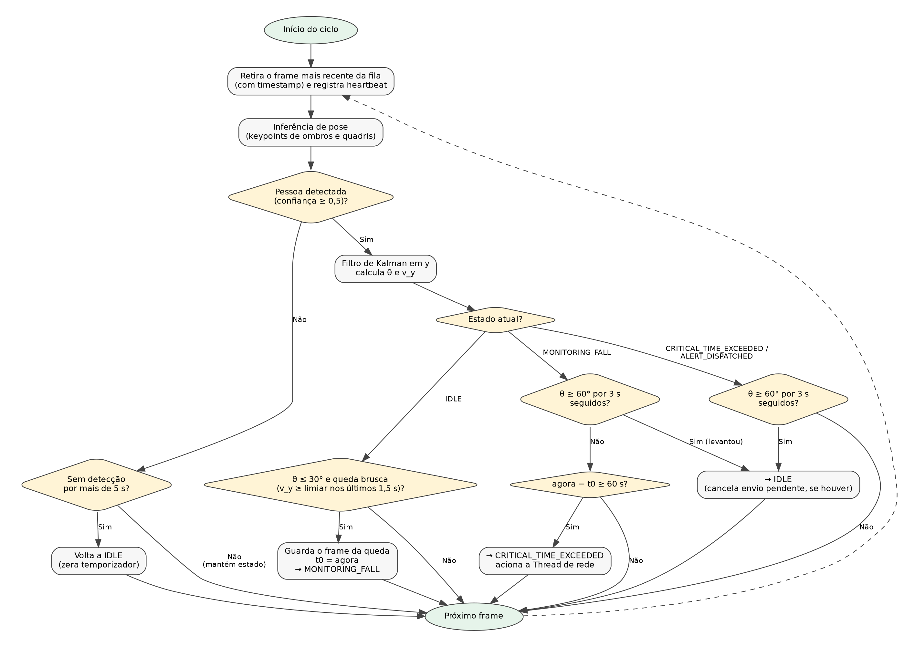

# Projeto Conceitual de Software

Este documento explica o algoritmo e a organização do software do **Projeto Alerta de Queda**: como o sistema captura o vídeo, decide que houve uma queda, espera 60 segundos antes de alertar, envia o aviso pelo Telegram e se integra ao sistema operacional da Raspberry Pi 3B. O texto justifica as escolhas de projeto em vez de reproduzir o código.

## 1. Visão geral e requisitos atendidos

| Requisito | Onde é atendido |
|:--|:--|
| REQ-01 Captura contínua a 15 FPS | Seção 2 (coleta de dados) |
| REQ-02 Detecção de queda | Seção 3 (processamento) |
| REQ-03 Temporizador de 60 s | Seção 4 (máquina de estados) |
| REQ-04 Alerta via Telegram | Seção 6 (transmissão) |
| REQ-05 Foto no alerta | Seções 4 e 6 |
| REQ-06 Inicialização automática | Seção 8 (sistema operacional) |
| REQ-07 Processamento local | Seções 2 e 3 (nenhum vídeo sai da placa; só o alerta com uma foto é enviado) |
| REQ-08 Sinalização de status | Seção 5 (atuadores) |

O sistema é composto por quatro _threads_ que trocam dados por uma fila e por eventos (Figura 1). A decisão central está em uma máquina de estados finitos (FSM) executada pela _thread_ consumidora.



**Figura 1.** Arquitetura de _threads_ do serviço e sua relação com o `systemd`.

## 2. Coleta de dados

- **Captura:** o vídeo é lido da câmera CSI-2 a **15 FPS**, em 640 × 480 pixels. O valor de 15 FPS é o mínimo do REQ-01 e é suficiente para detectar a transição para o chão, que dura de algumas centenas de milissegundos a poucos segundos.
- **Pré-processamento:** o quadro é reduzido para a entrada do modelo (por exemplo, 256 × 256), preferencialmente no próprio _pipeline_ da câmera (fluxo de baixa resolução do ISP), e não na CPU. A conversão de espaço de cor (BGR para RGB) usa operações vetorizadas. Ambas as medidas poupam ciclos de CPU, que são o gargalo do sistema.
- **Fila com descarte:** a _thread_ produtora coloca os quadros em uma fila de tamanho 2. Se a fila estiver cheia, o quadro mais antigo é descartado (_frame dropping_). Como a inferência na Raspberry Pi 3B pode ser mais lenta que a captura, isso garante que o sistema sempre processe uma imagem recente, em vez de acumular atraso.
- **Marca de tempo:** cada quadro recebe o instante real da captura. Todos os cálculos de velocidade e de tempo usam essas marcas, e não o número de quadros, porque a taxa efetiva da inferência pode ficar abaixo de 15 FPS.

## 3. Processamento de dados

### 3.1 Escolha do estimador de pose

O sistema usa um estimador de pose por _keypoints_ (pontos articulares), e não um detector baseado só em caixa delimitadora. O motivo é que a caixa de uma pessoa deitada e a de uma pessoa agachada ou sentada podem ter proporções parecidas, enquanto a posição dos ombros e dos quadris diz diretamente se o tronco está em pé ou deitado.

- **Candidato principal:** BlazePose, do MediaPipe, em sua versão leve, projetada para execução em dispositivos de borda [1][2].
- **Alternativa:** YOLOv8-Pose em modelo pequeno quantizado em INT8 [3].
- **Decisão final:** será tomada por _benchmark_ na própria Raspberry Pi 3B (FPS e qualidade da detecção), na tarefa 2.3.3 do cronograma.

Só são usados os _keypoints_ com confiança mínima de 0,5. Quadros em que ombros ou quadris não são detectados são tratados como "sem detecção".

### 3.2 Métricas calculadas por quadro

**Inclinação do tronco (θ).** É o ângulo do segmento que liga o ponto médio dos ombros ao ponto médio dos quadris em relação ao eixo horizontal da imagem. θ próximo de 90° indica tronco em pé, e θ próximo de 0° indica tronco deitado:

```
θ = atan2( |y_ombros − y_quadris| , |x_ombros − x_quadris| )
```

O uso de `atan2` evita a divisão por zero quando o tronco está exatamente na vertical (diferença em x igual a zero).

**Velocidade vertical (v_y).** É a velocidade de descida do centróide dos _keypoints_ visíveis, medida em **troncos por segundo**, ou seja, dividida pelo comprimento do tronco (distância entre o ponto médio dos ombros e o dos quadris) no mesmo quadro. Essa normalização torna o valor independente da distância entre a pessoa e a câmera. A velocidade é calculada com as marcas de tempo reais dos quadros.

**Filtro de Kalman.** Um filtro de Kalman unidimensional [4] é aplicado à coordenada y do centróide para suavizar o ruído da inferência e manter a estimativa durante oclusões parciais (por exemplo, um móvel cobrindo as pernas).

### 3.3 Parâmetros iniciais

Os valores abaixo são o ponto de partida e serão calibrados com vídeos reais nos testes de subsistemas (tarefa 2.3.3):

| Parâmetro | Valor inicial | Função |
|:--|:-:|:--|
| Limiar de "deitado" | θ ≤ 30° | Tronco considerado horizontal |
| Limiar de "em pé" | θ ≥ 60° | Tronco considerado erguido (a diferença para 30° é uma histerese que evita oscilações) |
| Queda brusca | v_y ≥ 1,5 troncos/s em algum instante dos últimos 1,5 s | Distingue queda de deitar-se devagar |
| Tempo crítico | 60 s | Permanência no chão antes do alerta (REQ-03) |
| Tempo de recuperação | 3 s seguidos com θ ≥ 60° | Confirma que a pessoa se levantou |
| Tolerância a perda de detecção | 5 s | Evita zerar o estado por falhas curtas ou oclusões |

## 4. Lógica de decisão e temporizador (máquina de estados)

A _thread_ consumidora executa a máquina de estados da Figura 2, que representa o ciclo de vida de uma ocorrência. O fluxograma da Figura 3 detalha o que acontece a cada quadro.



**Figura 2.** Máquina de estados finitos do monitoramento.

| Estado | Significado | Sai quando |
|:--|:--|:--|
| `IDLE` | Nenhuma ocorrência em andamento | θ ≤ 30° **e** queda brusca → vai para `MONITORING_FALL` |
| `MONITORING_FALL` | Pessoa caída; temporizador de 60 s em contagem | Passam 60 s → `CRITICAL_TIME_EXCEEDED`; a pessoa se levanta ou some do campo de visão → `IDLE` |
| `CRITICAL_TIME_EXCEEDED` | Alerta solicitado à _thread_ de rede | Telegram confirma o envio → `ALERT_DISPATCHED`; a pessoa se levanta antes do envio → `IDLE` |
| `ALERT_DISPATCHED` | Alerta já entregue | A pessoa se levanta → `IDLE` |

Pontos importantes do projeto:

- **A velocidade v_y só serve para _entrar_ em `MONITORING_FALL`.** Depois da queda a pessoa fica parada e v_y é próxima de zero. Se esse critério fosse reavaliado a cada quadro, o temporizador seria zerado imediatamente. Dentro de `MONITORING_FALL`, o único critério para continuar é a pessoa permanecer deitada.
- **A foto do alerta é o quadro do momento da queda.** Ele é guardado em memória ao entrar em `MONITORING_FALL`, atendendo ao REQ-05.
- **Sem repetição de alertas.** Em `ALERT_DISPATCHED` nenhum novo alerta é gerado; o sistema só volta a `IDLE` quando a pessoa se levanta.
- **Tempo medido com relógio monotônico**, imune a ajustes de data e hora do sistema.



**Figura 3.** Fluxograma do ciclo da _thread_ consumidora (um quadro por ciclo).

## 5. Atuadores e interface com o usuário

O sistema não tem interface gráfica (_headless_), para deixar o máximo de memória para a inferência. A _thread_ de supervisão cuida dos atuadores:

- **LED de status (GPIO 23):** é aceso quando o serviço termina de iniciar e confirma que o monitoramento está ativo (REQ-08).
- **Ventoinha (PWM no GPIO 18):** a temperatura do SoC é lida a cada 5 s. Abaixo de ≈ 50 °C a ventoinha fica na rotação mínima ou desligada; entre ≈ 50 °C e ≈ 70 °C o _duty cycle_ cresce linearmente; a partir de ≈ 70 °C opera a 100%. Os limites serão ajustados nos testes térmicos. Como o GPIO 18 também é usado pelo áudio analógico, o áudio da placa é desativado, já que o sistema não precisa dele.

## 6. Armazenamento e transmissão

1. Ao entrar em `MONITORING_FALL`, o quadro da queda é guardado em memória e, quando o alerta é solicitado, codificado em JPEG (qualidade ≈ 80, para reduzir o tamanho) em arquivo temporário no _tmpfs_ (RAM), poupando o cartão microSD.
2. A _thread_ de rede monta uma única requisição HTTPS ao método `sendPhoto` da API de bots do Telegram [5], contendo a foto e uma legenda com a mensagem de socorro e o horário. Assim, texto e imagem chegam juntos.
3. **Falhas de rede:** o envio tem tempo limite de 10 s. Se falhar, há até 5 novas tentativas com espera crescente (5, 10, 20 e 40 s). Esgotadas as tentativas, o erro é registrado no _journal_ e o ciclo se repete a cada 60 s até o envio ter sucesso ou a pessoa se levantar.
4. **Segredos:** o _token_ do bot e o identificador do chat ficam em um arquivo de variáveis de ambiente fora do repositório (seção 8), e nunca no código.

## 7. Concorrência

O serviço usa quatro _threads_ (módulo `threading` do Python):

1. **Produtora:** só captura e enfileira quadros.
2. **Consumidora:** estima a pose, calcula as métricas e executa a máquina de estados.
3. **Rede:** fica ociosa até receber o evento de alerta; faz o envio sem travar a captura nem a inferência.
4. **Supervisão:** controla a ventoinha e o LED e alimenta o _watchdog_ (seção 8).

A separação impede que uma conexão lenta com o Telegram congele a câmera. O módulo `threading` é suficiente porque as chamadas nativas de visão e inferência (OpenCV e MediaPipe/TFLite) e as operações de rede liberam o bloqueio global do Python (GIL) durante a execução. Se os testes mostrarem que a inferência disputa CPU com a captura, a alternativa é mover a inferência para um processo separado.

## 8. Inserção no sistema operacional

- **Sistema:** Raspberry Pi OS em versão _Lite_ (sem ambiente gráfico). Serviços sem uso (por exemplo Bluetooth e `avahi-daemon`) são desativados para liberar CPU e memória.
- **Inicialização automática (REQ-06):** o programa roda como serviço do `systemd` (`alerta_queda.service`), iniciado após a rede estar disponível. A reinicialização automática garante recuperação após falhas de software e quedas de energia. Trecho essencial da unidade [6]:

```ini
[Unit]
After=network-online.target
Wants=network-online.target

[Service]
Type=notify
ExecStart=/usr/bin/python3 /opt/alerta_queda/main.py
EnvironmentFile=/etc/alerta_queda.env
Restart=always
RestartSec=5
WatchdogSec=15

[Install]
WantedBy=multi-user.target
```

- **Segredos:** o arquivo `/etc/alerta_queda.env` guarda o _token_ do bot e o identificador do chat, com permissão restrita ao administrador.
- **_Watchdog_ em dois níveis:**
  1. **Do serviço (`WatchdogSec=15`):** a _thread_ de supervisão envia o aviso de vida (`WATCHDOG=1`) ao `systemd` **somente se** as _threads_ produtora e consumidora tiverem registrado atividade nos últimos 5 s. Se alguma travar, o aviso deixa de ser enviado e o `systemd` reinicia o serviço.
  2. **De _hardware_ (`RuntimeWatchdogSec=15` em `/etc/systemd/system.conf`):** o `systemd` passa a alimentar o _watchdog_ do SoC; se o próprio sistema travar, a placa é reiniciada.
- **Diagnóstico:** os registros do serviço e os avisos de erro são consultados com `journalctl -u alerta_queda`.

## 9. Limitações conhecidas e validação

- **Ângulo da câmera:** com a câmera no teto, o ângulo θ é medido no plano da imagem, e uma pessoa que cai em direção à câmera pode parecer menos horizontal. Os limiares serão validados com quedas em várias direções.
- **Quedas lentas** (desfalecimento gradual) podem ter v_y baixa e não entrar em `MONITORING_FALL`; o limiar de v_y será ajustado na calibração.
- **Oclusão total** (pessoa caída atrás de um móvel) impede a detecção; fica registrada como limitação do escopo de um único cômodo e uma única câmera.
- **Desempenho:** o objetivo de 15 FPS na Raspberry Pi 3B é o principal risco técnico. O plano alternativo é reduzir a resolução de entrada, processar um quadro a cada dois ou trocar para um modelo mais leve (tarefa 2.4.3 do cronograma).
- **Validação:** acurácia, latência e falsos positivos (agachar, sentar, deitar voluntariamente) serão medidos em ambiente controlado, com iluminações diferentes (tarefas 2.5.1 a 2.5.3).

## Referências

1. C. Lugaresi et al., "MediaPipe: A Framework for Building Perception Pipelines," arXiv:1906.08172, 2019.
2. V. Bazarevsky et al., "BlazePose: On-device Real-time Body Pose Tracking," arXiv:2006.10204, 2020.
3. Ultralytics, _YOLOv8 Pose_ (documentação). Disponível em: [https://docs.ultralytics.com/tasks/pose/](https://docs.ultralytics.com/tasks/pose/).
4. R. E. Kalman, "A New Approach to Linear Filtering and Prediction Problems," _Journal of Basic Engineering_, vol. 82, 1960.
5. Telegram, _Bot API_ (método `sendPhoto`). Disponível em: [https://core.telegram.org/bots/api](https://core.telegram.org/bots/api).
6. freedesktop.org, _systemd.service(5)_ e _sd_notify(3)_ (documentação do `systemd`).
